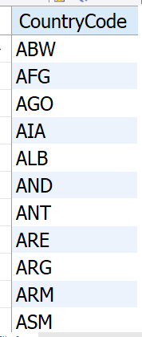

# My SQL Project
Performed some basic queries to showcase SQL knowledge. The WORLD database used for this project is from: https://relational.fit.cvut.cz/dataset/World
    
    Used MySQL Workbench to connect to the database and to write and execute queries. Only had permission to read the database.

# Database Structure
World database contains 3 tables:

## City Table:

`select * from City;`

## Country Table:

`select * from Country;`

## CountryLanguage Table: 

`select * from CountryLanguage;`

# SQL Queries

## Select specific Column(s):

`select Name, Population from City;`

## Select distinct 

`select distinct CountryCode from City;`

## Where Clause & Between
`SELECT * FROM City WHERE Population BETWEEN 100000 AND 300000;`

## Where, AND, OR

`SELECT * FROM City WHERE CountryCode="DEU" OR (CountryCode="ESP" AND District="Madrid");`

## Order By

`SELECT * from CountryLanguage ORDER BY Percentage DESC`

## Insert Into

`Insert INTO City (Name, CountryCode, District, Population)
Values ('Magic City', 'MGC', 'Sparkle', '5000');`

## Is Not Null

`SELECT * FROM City WHERE District IS NOT NULL;`

## Update

`UPDATE city SET Name = 'J-town' WHERE ID =1; `

 ## Delete Record

 `DELETE FROM City Where Name="Kabul";`

 ## Limit

 `SELECT * from City WHERE Population >= 2000000 LIMIT 3;`

 

## Min 

`SELECT MIN(SurfaceArea) from Country;`

 

 ## Count the number of countries

 `SELECT COUNT(Name) AS NumberOfCountries FROM Country;`

  

## Average Life expectancy of all the countries

`SELECT AVG(LifeExpectancy) AS AverageLife FROM Country; -- Average life Expectancy of every country`

 

 ## Sum of the population from each country

 `SELECT SUM(Population) AS WorldPopulation FROM Country;`

## Like - show countries with "land" in the name

`Select Name FROM Country WHERE Name LIKE '%land%';`

##  IN

`SELECT * FROM Country WHERE Continent IN ("Asia", "Africa");`

## Between a range of two countries

`SELECT * FROM Country WHERE Name BETWEEN 'Albania' AND 'France' ORDER BY Name; -- selects range of text in alphabetical order`

## Concat - make a string from two column values

`SELECT NAME , CONCAT(Continent, ', ', Region) AS Location from Country; -- concat to join column names`

## Inner Join

`SELECT City.Name, City.District, City.Population, CountryLanguage.CountryCode, CountryLanguage.Language
From City
INNER JOIN CountryLanguage ON City.CountryCode = CountryLanguage.CountryCode;`

## Left Join

`SELECT City.Name, Country.LifeExpectancy 
From City
LEFT JOIN Country ON City.CountryCode = Country.Code
ORDER BY Country.LifeExpectancy;`

## Union - add city and country names together

`SELECT Name FROM City
Union
SELECT Name FROM Country
ORDER BY Name DESC;`

## Group By

`SELECT COUNT(Name) as Total, Continent FROM Country
GROUP BY Continent;`

## Cases

    SELECT Name, Population, LifeExpectancy, SurfaceArea,
    CASE
        WHEN LifeExpectancy > 85 THEN 'Great Healthcare and longlife expected'
        WHEN LifeExpectancy >= 70 THEN 'Decent healthcare and average life expected'
        WHEN LifeExpectancy < 70 Then 'Bad Healthcare and short life expected'
    END AS "Life Expectancy Overview"
    FROM Country;

# Sources

https://www.w3schools.com/sql/default.asp

https://relational.fit.cvut.cz/dataset/World

